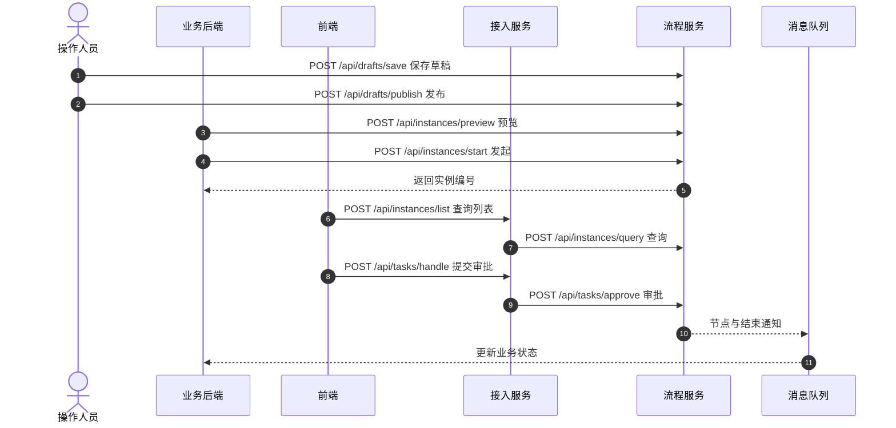
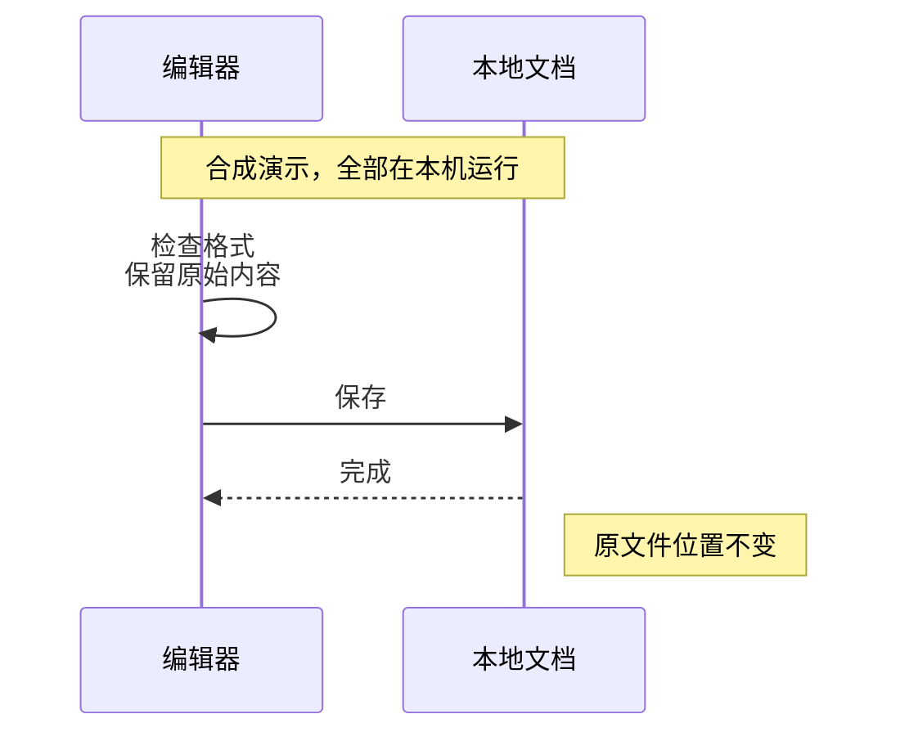

# 离线时序图

点击顶部“MD 预览”，或按 Ctrl+R 切换阅读。宽图可使用底部水平滚动条。

## 业务交互示例

```mermaid
sequenceDiagram
    autonumber
    actor W as 操作人员
    participant B as 业务后端
    participant F as 前端
    participant U as 接入服务
    participant C as 流程服务
    participant M as 消息队列
    W->>C: POST /api/drafts/save 保存草稿
    W->>C: POST /api/drafts/publish 发布
    B->>C: POST /api/instances/preview 预览
    B->>C: POST /api/instances/start 发起
    C-->>B: 返回实例编号
    F->>U: POST /api/instances/list 查询列表
    U->>C: POST /api/instances/query 查询
    F->>U: POST /api/tasks/handle 提交审批
    U->>C: POST /api/tasks/approve 审批
    C-->>M: 节点与结束通知
    M-->>B: 更新业务状态
```

## 自调用和说明

```mermaid
sequenceDiagram
    participant A as 编辑器
    participant B as 本地文档
    Note over A,B: 合成演示，全部在本机运行
    A->>A: 检查格式<br>保留原始内容
    A->>B: 保存
    B-->>A: 完成
    Note right of B: 原文件位置不变
```

当前为有限的 Mermaid 时序图支持。其他图类型及分支、循环、激活或配置指令会显示提示并保留源码。
